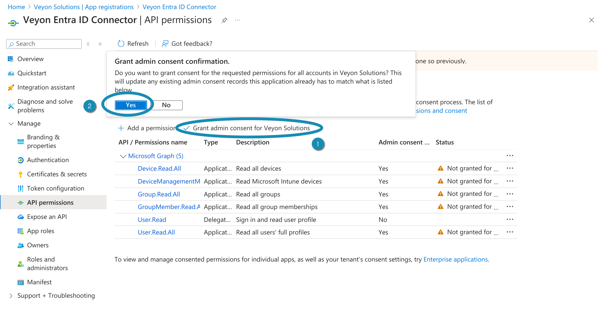

.. _EntraIdConnector:

Entra ID Connector
==================

General
-------

The Veyon Entra ID Connector add-on extends Veyon Master to read devices and their location from an Entra ID instance. Once set up, computers and locations no longer have to be maintained in the builtin network object directory. A previously configured LDAP/ActiveDirectory integration can be replaced with the Entra ID connector after migrating an On Premise ActiveDirectory to Entra ID in the Azure cloud.

Initial setup
-------------

First of all the Veyon Add-ons package needs to be installed. Make sure to download and install the version corresponding to your Veyon installation, i.e. Veyon 4.9.1 requires Veyon Add-ons 4.9.1 while for Veyon 4.8.3 you need to install version 4.8.3 of the add-ons. Please refer to :ref:`DeployingAddons` for further information.

After the installation has completed, you'll see some new configuration pages in the Veyon Configurator program. One of them is called :guilabel:`Entra ID Connector` and allows to set up the add-on:

   Entra ID Connector configuration page

App registration
----------------

In order to fill the required fields, the connector has to be registered in your Entra ID instance first. For doing so open a web browser and nagivate to the Entra ID management area in the Azure Portal. Here you can register the Veyon Entra ID Connector as an application:

   App registration of the Veyon Entra ID Connector – Step 1

Clicking :guilabel:`New registration` opens a new dialog where you have to enter a suitable name, e.g. *Veyon Entra ID Connector* and click on :guilabel:`Register`:

   App registration of the Veyon Entra ID Connector – Step 2

After the app has been registered, you can already see the required IDs in the :guilabel:`Overview` page. Copy the *Application (client) ID* and *Directory (tenant) ID* to the corresponding fields in the Veyon Configurator:

   App registration of the Veyon Entra ID Connector – Step 3

Client secrets
--------------

Next, the client secret or certificate must be configured with which the Entra ID Connector can authenticate itself to the Azure cloud. Open the :guilabel:`Certificates & secrets` page and click on :guilabel:`New client secret`. Give the secret a name and specify when it will expire. Do not choose a too short period as you have to create a new secret and reconfigure Veyon everytime a client secret has expired:

   Create client secret for the Veyon Entra ID Connector – Step 1

After the client secret has been created, you have to copy its value to the :guilabel:`Client secret` field in the Veyon Configurator.

   Create client secret for the Veyon Entra ID Connector – Step 2

.. important:: The client secret value has to be copied immediately since it is only shown once directly after creating the client secret. If you forgot to copy it, you have to delete the secret and create a new one.

You can now verify that the tenant ID, application ID and client secret are correct by clicking on the :guilabel:`Test access` button.

.. hint:: A good alternative to client secrets are client certificates. This allows storing the secret at a specific location where you can set access permissions as desired. Otherwise the client secret is stored (encrypted) as part of the Veyon Configuration.

API permissions
---------------

The last important task is to set up the permissions for the registered app so that the Entra ID Connector can read the required information from Entra ID. Navigate to the :guilabel:`API permissions` page, click on the :guilabel:`Add a permission` button and select :guilabel:`Microsoft Graph`:

   Set up permissions for the Veyon Entra ID Connector – Step 1

Now the actual permissions have to be selected. Select :guilabel:`Application permissions`, search for the *Device.Read.All* permission and check it:

   Set up permissions for the Veyon Entra ID Connector – Step 2

Repeat this step for the permissions *Group.Read.All*, *GroupMember.Read.All* and *User.Read.All*. If your devices are managed via Microsoft Intune and MAC addresses should be read from Intune, also add the *DeviceManagementManagedDevices.Read.All* permission. After checking all required permissions, click on :guilabel:`Add permissions`.

The last step is to grant admin consent for these permissions. This can easily be done by clicking on :guilabel:`Grant admin consent for <YOUR-ORGANIZATION>`:

   Set up permissions for the Veyon Entra ID Connector – Step 3

Filters
-------

Filters make it possible to read out only certain objects (devices, users and groups) and make them available for Veyon. This depends largely on how the objects are structured in your Entra ID instance and which of them are required for Veyon. If, for example, security groups are used as locations (rooms), the :guilabel:`Device groups filter` can be adjusted accordingly so that only groups starting with ``Room`` are used as locations. In that case a suitable filter would be ``startsWith(displayName, 'Room')``.

See `Operators and functions supported in filter expressions <https://learn.microsoft.com/en-US/graph/filter-query-parameter?tabs=http#operators-and-functions-supported-in-filter-expressions>`_ for further information.

Devices
-------

In this section you can configure how certain device properties are retrieved. While the display name is always used as computer name, both hostname and the MAC address can be determined in different ways.

Hostname source
	If all device names match the hostnames and can be resolved to IP addresses using an internal DNS server (BIND, AD DS etc.) you can keep the default option :guilabel:`Device name`. You should not rely on legacy name resolution protocols such as NetBIOS. You can easily verify this by running ``nslookup <HOSTNAME>``. If the device names can't be resolved by a DNS server in your network, it's recommended to either resolve them via `multicast DNS <https://en.wikipedia.org/wiki/Multicast_DNS>`_ or store the actual hostname or host address in a custom :guilabel:`Hostname attribute`.

MAC address source
	Veyon uses MAC addresses for powering on computers via `Wake-on-LAN <https://en.wikipedia.org/wiki/Wake-on-LAN>`_. If you want to take advantage of this feature you can populate each device's MAC addresses in a certain (extension) attribute and enter the name of this attribute in the :guilabel:`MAC address attribute` field. If your devices are managed via Microsoft Intune you can also change the setting to use the Ethernet or Wi-Fi MAC addresses stored in Intune. Depending on the selected option, only the Ethernet or Wi-Fi MAC addresses are read or one of them while the first one is prioritized (i.e. the 2nd address only used if the 1st address is empty). Don't forget to add the *DeviceManagementManagedDevices.Read.All* API permission.

Locations
---------

In Veyon all computers are grouped into locations (rooms). To properly group the devices read from Entra ID, a suitable mapping mode needs to be chosen:

Use device groups
	Select this mode if your devices belong to (security) groups which correspond to locations. This is the most preferred way since in Entra ID it's quite easy to create groups for each room and add the devices to the corresponding groups. Most likely you will have to configure a suitable :guilabel:`Device groups filter` in the :guilabel:`Filters` section such that only these groups (e.g. starting with name ``Room``) are displayed as locations. Optionally you can configure the name of the group attribute which to use as location name. Per default the group's display name is used.

Use location attribute of device
	 As an alternative to location-based groups, the location of each computer can also be stored in an (extension) attribute. In this case, the name of this attribute must be specified.

Extract from hostname via regular expression
	If the hostnames contain the room or location name, you can let Entra ID Connector extract the location name. This is done by applying a regular expression on the hostnames. The first capture group of the regular expression is then used as location / computer name.

	For example, if the hostnames have the format ``r<ROOM-NUMBER>-c<COMPUTER-NUMBER>`` (e.g. ``r101-c01.example.org``), you can use the following regular expression to extract the location name:

	``([^-]*)-.*``

	The first capture (in braces) captures everything until the first minus sign, so the location displayed in Veyon Master will be ``r101``.

	Please refer to the `Wikipedia article on regular expressions <https://en.wikipedia.org/wiki/Regular_expression>`_ for more information on the concept, syntax and available pattern options.

Completion
----------

Finally, the network object directory backend needs to be changed to *Entra ID Connector* so that Veyon Master actually uses the Entra ID Connector add-on.

.. figure:: images/entra-id-backend.png
   :class: image-drop-shadow
   :align: center

   Change network object directory backend to Entra ID Connector

Now you can start Veyon Master and should see the locations and computers from your Entra ID directory.

.. important:: Due to limitations in the Windows SSP authentication API, it's **not** possible to use Veyon's *logon authentication* with cloud-only Entra ID accounts. Please use *key file authentication* instead or make sure the accounts including password hashes are synced to an On Premise Active Directory.
