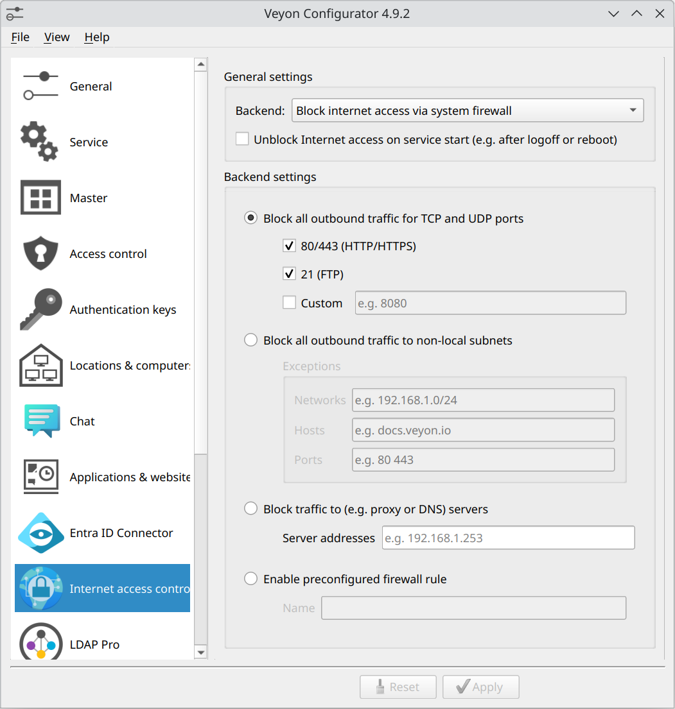

.. _InternetAccessControl:

Internet Access Control
=======================

General
-------

The Veyon Internet Access Control add-on allows blocking the access to the Internet for the whole class or individual computers in situations such as exams. The Internet access is blocked client-side by using mechanisms provided by the different backends.

Initial setup
-------------

First of all the Veyon Add-ons package needs to be installed. Make sure to download and install the version corresponding to your Veyon installation, i.e. Veyon 4.7.0 requires Veyon Add-ons 4.7.0 while for Veyon 4.5.7 you need to install version 4.5.7 of the add-ons. Please refer to :ref:`DeployingAddons` for further information.

After the installation has completed, you'll see some new configuration pages in the Veyon Configurator program. One of them is called :guilabel:`Internet access control` and allows to set up the add-on:

In most cases you can leave the default settings and continue with deploying the add-on to the student computers. If you make changes to the configuration, remember to always deploy the updated configuration to the student computers, since all settings affect the way the Internet access is blocked client-side.

Now you can start Veyon Master and can click the :guilabel:`Internet access` button to open the menu with the :guilabel:`Block Internet access` and :guilabel:`Unblock Internet access` items. After activating the :guilabel:`Block Internet access` item, the users on the selected computer(s) no longer should be able to open a website on the Internet. If they still are, please check the settings and possibly try another blocking mode or backend.

