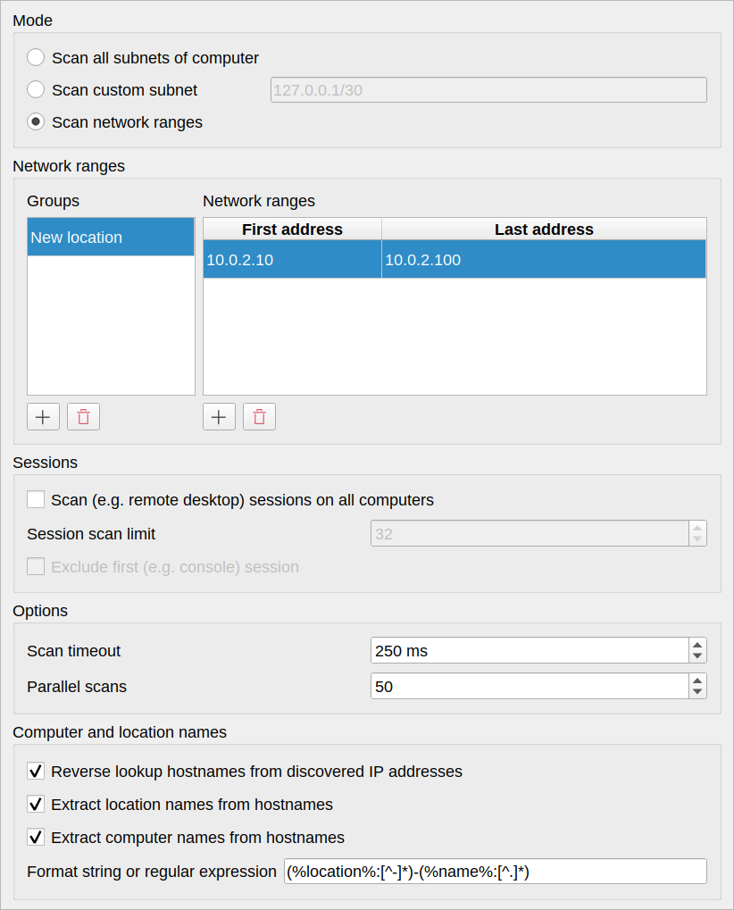
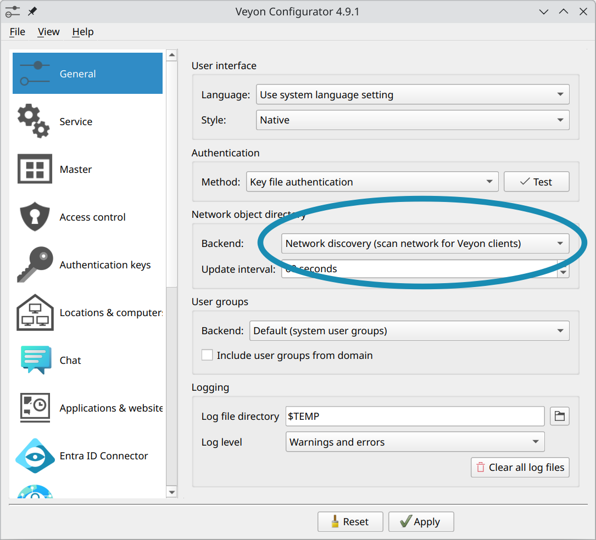

.. _NetworkDiscovery:

Network Discovery
=================

General
-------

The Veyon Network Discovery add-on extends Veyon Master to scan configured networks for computers running one or multiple Veyon Server instances. All discovered computers and RDP sessions show up instantly in the Locations & computers panel. Once set up, computers and locations no longer have to be maintained in the builtin network object directory nor does the LDAP/ActiveDirectory integration have to be configured. Last but not least, the add-on is perfectly suited for DHCP-based networks where the IP addresses of the computers are constantly changing.

Initial setup
-------------

First of all the Veyon Add-ons package needs to be installed. Make sure to download and install the version corresponding to your Veyon installation, i.e. Veyon 4.6.0 requires Veyon Add-ons 4.6.0 while for Veyon 4.5.7 you need to install version 4.5.7 of the add-ons. Please refer to :ref:`DeployingAddons` for further information.

After the installation has completed, you'll see some new configuration pages in the Veyon Configurator program. One of them is called :guilabel:`Network discovery` and allows to set up the add-on:

.. image:: images/network-discovery-configuration.png
   :scale: 75 %
   :align: center

You can start with the default settings if the subnet of the computer is small enough, i.e. the IPv4 prefix is ``/24`` or the subnet mask is ``255.255.255.0``. For larger subnets it's recommended to change the mode to :guilabel:`Scan network ranges` and add a group with a network range for testing (adopt the IP addresses to your environment):

Finally, the network object directory backend needs to be changed to *Network discovery* so that Veyon Master actually uses the Network Discovery add-on.

Now you can start Veyon Master and should see the computers in your network running a Veyon Server. Depending on the size of the subnet or network range(s), the initial scan process might take a while (up to 1-2 minutes in the worst case).

Fine tuning
-----------

After you have configured the desired subnets or network ranges, you can start tweaking the options for scanning computers to decrease the initial scan duration.

Normally your DNS server should be able to reverse lookup hostnames from IP addresses for all computers. If not, it's strongly recommended to change your DNS server settings accordingly. For environments where this is not feasible, you can disable the :guilabel:`Reverse lookup discovered IP addresss to host names` option to prevent unnecessary DNS timeouts.

In most cases you can increase the number of :guilabel:`parallel scans` to 100–300. Veyon Master opens the specified number of TCP connections in parallel so make sure to not exhaust the resources of the computer or per-process resource limits set by the operating system.

If all computers are on the same LAN (i.e. ping times of usually less than 1 ms) you can also decrease the :guilabel:`scan timeout` to 25–100 ms. Each computer responding within that timeout is shown in Veyon Master.

With a scan timeout of 25 ms and 250 parallel scans Veyon is able to scan ``25*250=6250`` computers per second. Using this formula you can easily calculate the ideal settings for your environment such that Veyon Master does not require too long for scanning while still detecting all computers reliably.

Command line interface
----------------------

The CLI module ``networkdiscovery`` allows scanning for computers at the command line:

.. describe:: scan [<SUBNET>]

    This command scans either the subnets of the local host or the specified subnets for computers running the Veyon Server.
