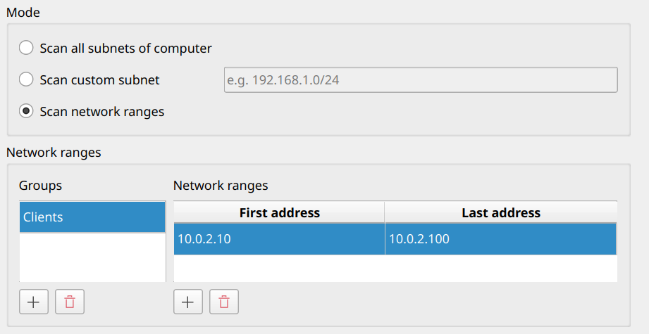

.. _NetworkDiscovery:

Network Discovery
=================

General
-------

The Veyon Network Discovery add-on extends Veyon Master to scan configured networks for computers running one or multiple Veyon Server instances. All discovered computers and RDP sessions show up instantly in the Locations & computers panel. Once set up, computers and locations no longer have to be maintained in the builtin network object directory nor does the LDAP/ActiveDirectory integration have to be configured. Last but not least, the add-on is perfectly suited for DHCP-based networks where the IP addresses of the computers are constantly changing.

Initial setup
-------------

First of all the Veyon Add-ons package needs to be installed. Make sure to download and install the version corresponding to your Veyon installation, i.e. Veyon 4.9.0 requires Veyon Add-ons 4.9.0 while for Veyon 4.8.3 you need to install version 4.8.3 of the add-ons. Please refer to :ref:`DeployingAddons` for further information.

After the installation has completed, you'll see some new configuration pages in the Veyon Configurator program. One of them is called :guilabel:`Network discovery` and allows to set up the add-on:

.. image:: images/network-discovery-configuration.png
   :scale: 75 %
   :align: center

You can start with the default settings if the subnet of the computer is small enough, i.e. the IPv4 prefix is ``/24`` or the subnet mask is ``255.255.255.0``. For larger subnets it's recommended to change the mode to :guilabel:`Scan network ranges` and add a group with a network range for testing (adopt the IP addresses to your environment):

Finally, the network object directory backend needs to be changed to *Network discovery* so that Veyon Master actually uses the Network Discovery add-on.

Now you can start Veyon Master and should see the computers in your network running a Veyon Server. Depending on the size of the subnet or network range(s), the initial scan process might take a while (up to 1-2 minutes in the worst case).

Fine tuning
-----------

After you have configured the desired subnets or network ranges, you can start tweaking the options for scanning computers to decrease the initial scan duration.

Normally your DNS server should be able to reverse lookup hostnames from IP addresses for all computers. If not, it's strongly recommended to change your DNS server settings accordingly. For environments where this is not feasible, you can disable the :guilabel:`Reverse lookup hostnames from discovered IP addresses` option to prevent unnecessary DNS timeouts.

.. important:: On Windows, legacy WINS resolution via NetBIOS should be disabled to prevent issues where the NetBIOS hostname does not exactly match the DNS hostname (especially since NetBIOS hostnames always consist of uppercase letters only while the actual DNS hostnames usually do not). If NetBIOS is enabled, Network Discovery may obtain randomly changing hostname types (for a certain IP address) from the operating system on each scan/update. This causes constant reconnects to the computers since from the view of Veyon, a different computer has been discovered each time.

In most cases you can increase the number of :guilabel:`parallel scans` to 100–300. Veyon Master opens the specified number of TCP connections in parallel so make sure to not exhaust the resources of the computer or per-process resource limits set by the operating system.

If all computers are on the same LAN (i.e. ping times of usually less than 1 ms) you can also decrease the :guilabel:`scan timeout` to 25–100 ms. Each computer responding within that timeout is shown in Veyon Master.

With a scan timeout of 25 ms and 250 parallel scans Veyon is able to scan ``25*250=6250`` computers per second. Using this formula you can easily calculate the ideal settings for your environment such that Veyon Master does not require too long for scanning while still detecting all computers reliably.

Computer and location names
---------------------------

Depending on the mode, discovered computers are shown in the *Discovered computers* folder or in folders named like the configured network ranges groups. However if the hostnames also contain the room or location information, you can make Network Discovery extract the location folder name and optionally also the displayed computer name from the hostname. This is done by applying a regular expression on the hostnames. The first capture group of the regular expression is then used as location / computer name.

If you for example have hostnames in the format ``r<ROOM-NUMBER>-c<COMPUTER-NUMBER>`` (e.g. ``r101-c01.example.org``), you can change the location data source to :guilabel:`Extract from computer names` and use the following regular expression to extract the location name:

``([^-]*)-.*``

The first capture (in braces) captures everything until the first minus sign, so the location displayed in Veyon Master will be ``r101``.

The same substring extraction is possible for computer names as well (except for :guilabel:`Data source` is set to :guilabel:`IP address`). For the example hostname scheme, a regular expression to extract the computer name (i.e. strip location and domain name) would be:

``[^-]*-.([^.]*)*``

Please refer to the `Wikipedia article on regular expressions <https://en.wikipedia.org/wiki/Regular_expression>`_ for more information on the concept, syntax and available pattern options.

Command line interface
----------------------

The CLI module ``networkdiscovery`` allows scanning for computers at the command line:

.. describe:: scan [<SUBNET>]

    This command scans either the subnets of the local host or the specified subnets for computers running the Veyon Server.
