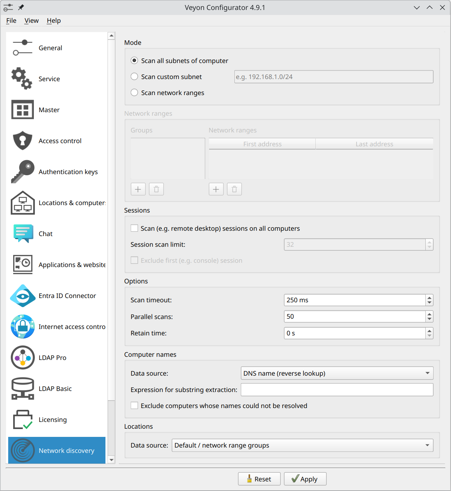

.. _NetworkDiscovery:

Network Discovery
=================

General
-------

The Veyon Network Discovery add-on extends Veyon Master to scan configured networks for computers running one or multiple Veyon Server instances. All discovered computers and RDP sessions show up instantly in the Locations & computers panel. Once set up, computers and locations no longer have to be maintained in the builtin network object directory nor does the LDAP/ActiveDirectory integration have to be configured. Last but not least, the add-on is perfectly suited for DHCP-based networks where the IP addresses of the computers are constantly changing.

Initial setup
-------------

First of all the Veyon Add-ons package needs to be installed. Make sure to download and install the version corresponding to your Veyon installation, i.e. Veyon 4.9.1 requires Veyon Add-ons 4.9.1 while for Veyon 4.8.3 you need to install version 4.8.3 of the add-ons. Please refer to :ref:`DeployingAddons` for further information.

After the installation has completed, you'll see some new configuration pages in the Veyon Configurator program. One of them is called :guilabel:`Network discovery` and allows to set up the add-on:

   Network Discovery configuration page

You can start with the default settings if the subnet of the computer is small enough, i.e. the IPv4 prefix is ``/24`` or the subnet mask is ``255.255.255.0``. For larger subnets it's recommended to change the mode to :guilabel:`Scan network ranges` and add a group with a network range for testing (adopt the IP addresses to your environment):

.. figure:: images/network-discovery-large-subnet-test.png
   :class: image-drop-shadow
   :align: center

   Only scan subnet of larger network

Finally, the network object directory backend needs to be changed to *Network discovery* so that Veyon Master actually uses the Network Discovery add-on.

.. figure:: images/network-discovery-backend.png
   :class: image-drop-shadow
   :align: center

   Change network object directory backend to Network Discovery
	
Now you can start Veyon Master and should see the computers in your network running a Veyon Server. Depending on the size of the subnet or network range(s), the initial scan process might take a while (up to 1-2 minutes in the worst case).

Options
-------

After you have configured the desired subnets or network ranges, you can start tweaking the options for scanning computers to decrease the initial scan duration.

In most cases you can increase the number of :guilabel:`parallel scans` to 100–300. Veyon Master opens the specified number of TCP connections in parallel so make sure to not exhaust the resources of the computer or per-process resource limits set by the operating system.

If all computers are on the same LAN (i.e. ping times of usually less than 1 ms) you can also decrease the :guilabel:`scan timeout` to 25–100 ms. Each computer responding within that timeout is shown in Veyon Master.

With a scan timeout of 25 ms and 250 parallel scans Veyon is able to scan ``25*250=6250`` computers per second. Using this formula you can easily calculate the ideal settings for your environment such that Veyon Master does not require too long for scanning while still detecting all computers reliably.

Sessions
--------

One typical use case of the Network Discovery add-on are environments with remote desktop servers running sessions which should be monitored using Veyon. Since these sessions are dynamic, it's hard to use statically configured hosts (even though optional port numbers can be specified). Instead you can simply enable the option :guilabel:`Scan sessions on all computers` and specify a limit – typically the maximum number of concurrent sessions on the server. Optionally it's possible to exclude the first session since often it's the local console session of the server at which only administrators log in or the primary login screen is visible.

Computer names
--------------

.. important:: On Windows, legacy WINS resolution via NetBIOS should be disabled to prevent issues where the NetBIOS hostname does not exactly match the DNS hostname (especially since NetBIOS hostnames always consist of uppercase letters only while the actual DNS hostnames usually do not). If NetBIOS is enabled, Network Discovery may obtain randomly changing hostname types (for a certain IP address) from the operating system on each scan/update. This causes constant reconnects to the computers since from the view of Veyon, a different computer has been discovered each time.

Per default Network Discovery tries to perform DNS reverse lookups to determine the hostnames corresponding to the discovered IP addresses. If computers are not known to your DNS servers there are several other ways to achieve human-readable computer names, especially in remote desktop scenarios:

User login name / Full name of user
	Select one of these options to use the login or full name of the logged in user as computer name.

Session client name / Session client address
	Select one of these option to use the name or address of the client (i.e. the workstation or thin client connected to the discovered remote desktop session) as computer name.

Hostname of session host
	Select this option to use the hostname of the remote desktop server (which is hosting the discovered remote desktop session) as computer name.

Environment variable
	Select this option to use the value of a certain environment variable in the user session as computer name. The name of the environment variable has to be specified.

Registry key
	Select this option to use the value of a registry key as computer name. The registry is read in the context of the logged in user so either a key in ``HKEY_CURRENT_USER`` or any other globally readable key can be read from.

.. note:: For all data sources except for :guilabel:`IP address` and :guilabel:`DNS name` Network Discovery establish temporary connections to all discovered computers to obtain the configured property. This slows down the scanning process and sligtly increases CPU load on the hosts while being scanned.

Optionally computers whose names can't be resolved can be excluded from being shown in Veyon Master.

Locations
---------

Depending on the mode, discovered computers are shown in the *Discovered computers* location or in locations named like the configured network ranges groups. However it's possible to use other information to model locations and map discovered computers to them. For this several alternative data sources are available:

Extract from computer names
	See section :ref:`ExtractNamesViaRegEx` for details.

Groups of logged-in users
	Select this option if users are organized in classes/courses and are members of corresponding class/course groups. Then these class/course groups will be used as locations. To only use these specific user groups (and filter out unrelated user groups), you can configure a filter expression. Only groups matching this filter expressions will be displayed as locations.

Environment variable
	Select this option to use the value of a certain environment variable in the user session as location name. The name of the environment variable has to be specified.

Registry key
	Select this option to use the value of a registry key as location name. The registry is read in the context of the logged in user so either a key in ``HKEY_CURRENT_USER`` or any other globally readable key can be read from.

.. _ExtractNamesViaRegEx:

Extracting computer and location names via regular expressions
--------------------------------------------------------------

Depending on the mode, discovered computers are shown in the *Discovered computers* location or in locations named like the configured network ranges groups. However if the hostnames also contain the room or location name, you can let Network Discovery extract the location name and optionally also the displayed computer name from the hostname. This is done by applying a regular expression on the hostnames. The first capture group of the regular expression is then used as location/computer name.

For example, if the hostnames have the format ``r<ROOM-NUMBER>-c<COMPUTER-NUMBER>`` (e.g. ``r101-c01.example.org``), you can change the location data source to :guilabel:`Extract from computer names` and use the following regular expression to extract the location name:

``([^-]*)-.*``

The first capture (in braces) captures everything until the first minus sign, so the location displayed in Veyon Master will be ``r101``.

The same substring extraction is possible for computer names as well (except for :guilabel:`Data source` is set to :guilabel:`IP address`). For the example hostname scheme, a regular expression to extract the computer name (i.e. strip location and domain name) would be:

``[^-]*-.([^.]*)*``

Please refer to the `Wikipedia article on regular expressions <https://en.wikipedia.org/wiki/Regular_expression>`_ for more information on the concept, syntax and available pattern options.

Command line interface
----------------------

The CLI module ``networkdiscovery`` allows scanning for computers at the command line:

.. describe:: scan [<SUBNET>]

    This command scans either the subnets of the local host or the specified subnets for computers running the Veyon Server.
