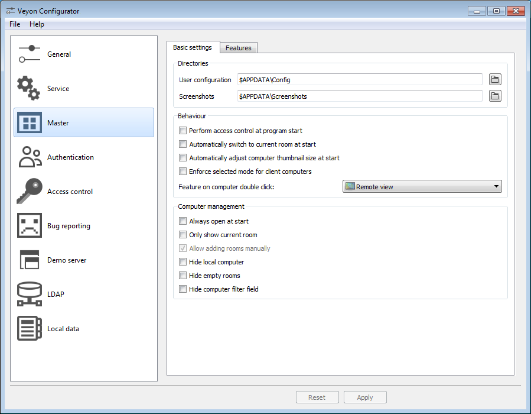

.. _Configuration:

Configuration
=============

To begin with the setup, start the Veyon Configurator if this has not already been done automatically after the installation. With this program a local Veyon installation can be set up and customized. The graphical user interface is divided into different topic- or component-related configuration pages. Depending on the installed plugins there may be additional configuration pages.

The :ref:`ConfigurationReference` describes all configuration pages and configuration options with their individual definitions and possible configuration values.

Overview
--------

The basic settings on the configuration page :ref:`RefGeneral` apply to all :ref:`components` of Veyon. These include settings for the :ref:`RefUserInterface`, :ref:`RefLogging`, :ref:`RefAuthentication` as well as the :ref:`RefNetworkObjectDirectory` which stores the locations and computers displayed in the Veyon Master.

The settings on the configuration page :ref:`RefService` influence the functionality of the Veyon Service and are used for fine-tuning and adaptation to implement special application scenarios. For smooth operation the default settings should normally not be changed.

All settings on configuration page :ref:`RefMaster` only affect the behavior and functions of the Veyon Master application and apply system-wide for all users.

.. index:: Quick start

.. hint:: For a quick start to get to know the software you only need to add a location and individual computers on configuration page :ref:`ConfLocationsAndComputers`. After the configuration has been :ref:`exported to all computers <ConfImportExport>` the Veyon Master application can already be started and used. It should be ensured that the user used at logon exists with the same password on all computers.

.. index:: Authentication, Authentication methods

.. _ConfAuthentication:

Authentication
--------------

In order to access a computer running the Veyon Service the accessing user must first authenticate himself, i.e. he has to prove his identity and usage authorization. Otherwise unrestricted access from any user to any computer running the Veyon Service would be possible. Access without authentication is not supported. The setup is done via the configuration page :ref:`RefGeneral` in section :ref:`RefAuthentication` in Veyon Configurator.

.. _ConfAuthenticationMethods:

Authentication methods
++++++++++++++++++++++

Basically Veyon offers two different authentication methods: key file authentication and logon authentication.

**Key file authentication** is based on `Public-Key-Cryptography <https://en.wikipedia.org/wiki/Public-key_cryptography>`_, meaning that a public key and a associated private key are used. Only certain users may have access to the private key. On each connection request the Veyon Service sends a random character sequence to Veyon Master, which Veyon Master has to sign cryptographically using the private key. The signature is sent back to the Veyon Service and verified with the corresponding public key. This verification only succeeds if the signature was generated with the appropriate private key. The authenticity of the counterpart is then guaranteed. If the signature verification fails, the connection is closed.

With **logon authentication** the counterpart encrypts its username and password and sends this data to the Veyon Service. The Veyon Service then attempts to perform an internal user login to the local system using the decrypted credentials. If this process is successful, the username and password are correct and the authenticity of the counterpart is ensured. If the login fails, the connection is closed.

Both methods have advantages and disadvantages so the choice of the right method depends on the environment, security requirements and desire for user comfort.

.. index:: Key file authentication, Public-key-cryptography, Public key, Private key, Key file

.. _ConfKeyFileAuthentication:

**Key file authentication**

+-------------------------------------------------+-------------------------------------------------+
| Advantages                                      | Disadvantages                                   |
+=================================================+=================================================+
| * no login with username and password required  | * more effort for the setup                     |
|   when starting Veyon Master                    | * user identity can not be assured even after   |
| * access to computers can be handled centrally  |   successful signature check                    |
|   by access rights to the file containing       | * system-wide exchange of key files necessary   |
|   the private key                               |   if compromised                                |
+-------------------------------------------------+-------------------------------------------------+

.. index:: Logon authentication, Username, Password

.. _ConfLogonAuthentication:

**Logon authentication**

+-------------------------------------------------+-------------------------------------------------+
| Advantages                                      | Disadvantages                                   |
+=================================================+=================================================+
| * easy and effortless setup                     | * login with username and password necessary    |
| * identity of counterpart can be assured,       |   whenever Veyon Master is used                 |
|   allowing to use :ref:`AccessControlRules`     |                                                 |
+-------------------------------------------------+-------------------------------------------------+

The respective authentication method can be chosen and configured as described in section :ref:`RefAuthentication` in the configuration reference.

Key management
++++++++++++++

.. index:: Key pair

In order to use the key file authentication, first a key pair consisting of a public and a private key has to be created. The configuration page :ref:`RefAuthenticationKeys` is available for this purpose. A new key pair is generated via the :guilabel:`Create key pair` button. A short, concise term such as ``teacher`` should be chosen as the name. Then an access group must be set for both private and public keys. Only users who are to be allowed to access computers using Veyon Master should be member of the access group set for private keys. The public key should be assigned to a global access group so that the key is readable for all users and the operating system.

Once key file authentication is set up and working with one client computer, the keys can also be transferred to a shared network drive and the :ref:`RefKeyFileDirectories` can be changed accordingly. On the client computers only the Veyon configuration has to be imported, while the key files do not have to be imported manually.

.. attention:: The private key file may only be accessible to users who should have access to other computers. If the file is stored on a network drive, it is therefore crucial to ensure that file access is restricted with using file ACLs or similar!

.. index:: Computer access control, Access control

.. _ConfAccessControl:

Access control
--------------

The access control module can be used to specify in detail which users may access certain computers. Access control is performed during connection initialization after a successful authentication. While authentication assures the authenticity of an accessing user, the access control functionality restricts computer access to authorized users such as teachers.

The setup is done on the :guilabel:`Access control` configuration page and is described in detail in the :ref:`configuration reference <ConfigurationReference>` as well as chapter :ref:`AccessControlRules`.

.. important:: Like all other settings the access control configuration is part of the local Veyon configuration. The configuration must therefore be :ref:`transferred to all other computers <ConfImportExport>` to work properly.

.. index:: Locations and computers

.. _ConfLocationsAndComputers:

Locations & computers
---------------------

On the configuration page :guilabel:`Locations & computers` you can create the locations and computers displayed in the Veyon Master application when the :ref:`RefNetworkObjectDirectory` backend *Builtin* is used. Unlike backends such as :ref:`LDAP <LDAP>` this information is stored in the local configuration and must therefore be transferred to all computers.

The configuration page consists of two lists. The left list contains all configured locations. Using the two buttons below the list, locations may be added or removed. Existing locations can be edited and renamed by double-clicking.

The list on the right contains all computers stored for the currently selected location. The two buttons below the list can be used to add or remove computers. The individual cells in the table can be edited by double-clicking them. A computer name and a hostname or IP address must be specified for each computer. To access Veyon Server instances other than the default (:ref:`Multi session mode <RefMultiSessionMode>`) the corresponding port numbers have to be appended, e.g. ``myhost.example.org:11101``. In case the `Wake-on-LAN <https://en.wikipedia.org/wiki/Wake-on-LAN>`_ feature is to be used, the corresponding MAC address must also be supplied. Otherwise this column can be left blank.

LDAP
----

All information about connecting Veyon to an LDAP-compatible server such as *OpenLDAP* or *Active Directory* can be found in chapter :ref:`LDAP`.

.. index:: Export configuration, Import configuration, Load settings, Save settings

.. _ConfImportExport:

Importing/exporting a configuration
-----------------------------------

An imported prerequisite for the use of Veyon is an identical configuration on all computers. Transferring the Veyon configuration to another computer can be done manually at first, but should be automated later. Different methods are available for both ways.

In the Veyon Configurator you can find the entry :guilabel:`Save settings to file` in the :guilabel:`File` menu. This entry allows to export the current configuration to a file in JSON format. This file can be imported to another computer using the entry :guilabel:`Load settings from file` in the same menu. Please note, that the settings are loaded into the user interface during the import, but are applied and saved in the system only after the :guilabel:`Apply` button has been pressed.

The :ref:`ConfigurationManagement` module of the :ref:`CommandLineInterface` can be used to automate/script configuration import and export.

Additionally, when performing an :ref:`automated installation <AutoInstall>` the configuration can be imported without requiring any further user interaction. In the example section an :ref:`example <InstallationConfigurationImport>` is given for the installer parameter ``/ApplyConfig``.

.. index:: Reset configuration, Reset settings, Clear configuration, Delete configuration

.. _ConfigReset:

Reset configuration
-------------------

In some error situations it may be advisable to completely reset the Veyon configuration and then restart with the default values. For this purpose you can use the entry :guilabel:`Reset configuration` in the :guilabel:`File` menu in the Veyon Configurator.

Alternatively the configuration can also be reset using the :ref:`ConfigurationManagement` module of the :ref:`CommandLineInterface`.

Furthermore the saved configuration can be reset on operating system level. On Linux the file :file:`/etc/xdg/Veyon Solutions/Veyon.conf` has to be deleted, while on Windows the registry key :file:`HKLM\\Software\\Veyon Solutions` and all of its subkeys have to be deleted.
