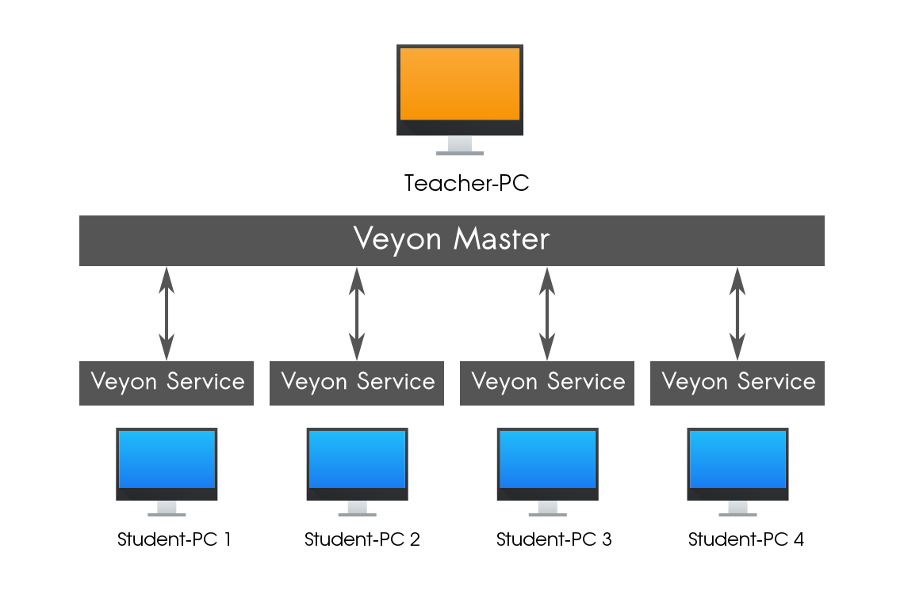
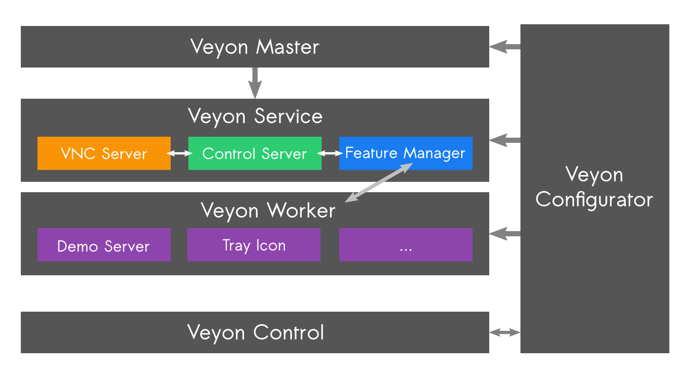
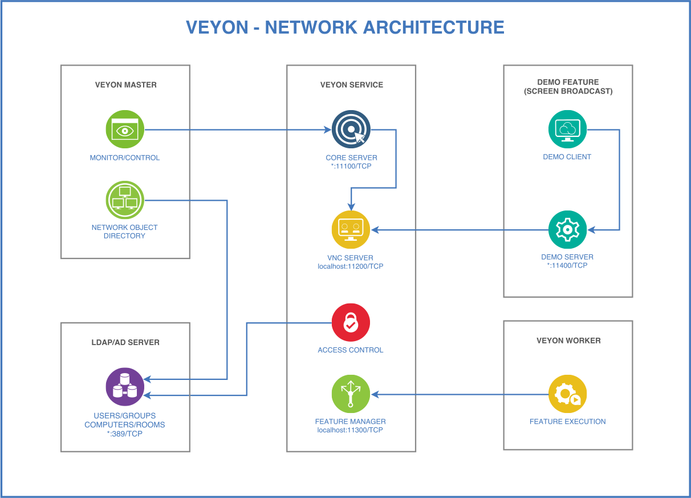

Introduction
============

About this manual
-----------------

This manual describes the installation and configuration of Veyon in a computer network and is addressed to system administrators and technically experienced users. For end users there is a separate user manual which describes the usage and individual functions of the user program (Veyon Master).

In the following sections of this chapter you will find basic information about Veyon and its components which are of fundamental importance for putting Veyon into operation.

Chapter :ref:`Installation` covers the installation of Veyon on a Windows or Linux computer. It also contains information on how to perform or implement an automated installation.

Chapter :ref:`Configuration` explains how to configure and integrate Veyon using the graphical configuration tool, whereas the :ref:`ConfigurationReference` describes all available configuration settings and options in detail. Information and examples on how to connect Veyon to an LDAP or ActiveDirectory server can be found in chapter :ref:`LDAP`.

Veyon also has a command line interface (:index:`CLI`) which can be used to modify the configuration, automate Veyon-related tasks and to use or control certain program features. All modules and commands of the command line tool are listed and explained in chapter :ref:`CommandLineInterface`.

In case Veyon causes problem during its installation or configuration actions can be taken as described in chapter :ref:`Troubleshooting`. Frequently asked questions are answered in chapter :ref:`FAQ`.

About Veyon
-----------

Veyon is a free and open source software for computer monitoring and class room management. It allows to monitor and control computer rooms as well as to interact with users, e.g. students. The following features are available in Veyon:

* Monitoring: overview of a (class) room with screen contents of computers being shown in thumbnails
* Remote view or control computers
* Broadcast the teacher's screen to all other computers in real time (full screen/window demo)
* Lock computers to control attention
* Distribute documents and other files to students
* Send text messages to students
* Power on, reboot or shutdown computers remotely
* Log out users
* Launch programs and open websites

.. index:: teacher computer, student computer, master computer, client computer

.. _Components:

Components
----------

Veyon basically consists of a master and a service component which realize the interaction between teacher and student computers (also referred to as *master computer* and *client computer*):

In detail there are several :index:`program components` that interact with each other in different ways:

:index:`Veyon Master`
    An application program that can be used to monitor and control other computers and utilize further Veyon features. In normal use, the program is started by the end user and accesses other computers via the Veyon Service.

:index:`Veyon Service`
    A non-graphical service application which monitors user sessions on a computer and starts Veyon Server instances within these sessions. The service and its server subprocesses are required to run on all computers including teacher computers.

:index:`Veyon Server`
    A server application which provides access to a computer as well as control and application functions. In regular operation this program is started by the Veyon Service automatically and with elevated privileges so it can't be terminated by users.

:index:`Veyon Worker`
    A helper program started by the server to provide specific functions in an isolated environment or in the context of the currently logged-on user. Those specific functions include the demo server for the teacher computer and the demo client on the student computers.

:index:`Veyon Configurator`
    A :index:`configuration tool` which allows to configure and customize all components of a local Veyon installation through a graphical user interface. The program is started by the administrator with elevated privileges whenever necessary.

:index:`Veyon CLI`
    A command line tool that in addition to the Veyon Configurator allows various configuration adjustments, automated tasks and the use of some Veyon features without graphical interaction. The program is run either interactively on the command line or script-controlled with usually administrative privileges.

Network architecture
--------------------

From a network perspective the following components and TCP ports are involved:

