.. _ProgramFeatures:

Program features
=================

Veyon offers a variety of features that can be used to control and access computers. All functions are neatly arranged in the toolbar. They are also accessible via the context menu of the students' PCs.

If you hover over the single buttons in the toolbar, a :index:`tooltip` with a short help message is displayed, unless you have not deactivated this behavior. Pressing a button activates the desired function for all displayed computers.

.. _SelectingComputers:
.. index:: selecting computers

Selecting computers
-------------------

If you want to apply a function only on a single computer, click it with the right mouse button and choose the desired function via the context menu. The entries in the context menu are dynamically displayed depending on the currently active functions.

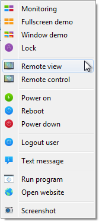

You can also select multiple computers by creating a rectangle with the mouse that includes all desired computers:

.. image:: images/select-computers.png
   :scale: 75 %
   :align: center

Alternatively, you can use the :kbd:`Ctrl` key and add computers to your selection one by one by clicking.

Monitoring mode
---------------

By default Veyon is running in monitoring mode. In this mode you have an overview of all computers and see their screen contents in small thumbnails, depending on the position of the zoom slider. The screen contents are updated almost in real time so that you can monitor all activities in the room.

As soon as the connection to a computer is interrupted, a computer icon is shown instead of the screen content. After the program has started, this icon is colored in grey at first. As soon as the program notices that a computer is not reachable or the access to it is denied, the icon's color changes to red.

Some of the functions described in the upcoming sections change the mode of a remote computer. You can stop each mode by simply returning to monitoring mode.

.. index:: demonstration mode, full screen demo, window demo, demo mode, demonstration, presentation

Demonstration mode
------------------

You can use the demonstration mode (or demo mode for short) to start a presentation. In this mode your screen content is broadcasted to and displayed at all remote computers in real time. Here you can choose between a full screen or a window demo.

As the name indicates, during a full screen demo, you screen content is displayed in full screen. The remote computers can not be operated in this mode as all input devices are locked. This way you can get the whole attention of your course participants.

By contrast, a window demo allows for the users to switch between the demo window and their own applications or even arrange the windows next to each other to comprehend the shown processes themselves. Hence the input devices are not locked.

In order to start a full screen or window demo, you just have to press the :guilabel:`Full Screen Demo` resp. :guilabel:`Window Demo` button:

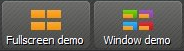

If you want to leave the demonstration mode, just press the respective button again or press the :guilabel:`Observe` button to switch back into monitoring mode globally. Using the context menu, the demonstration mode can also be quit for single computers.

.. index:: screen lock, lock, locked, input devices, lock screen

Lock screens
------------

Another method to enhance resp. control attention is the function which locks the screens.
As with the full screen demo, all input devices on the course participants' computers are locked
and cannot be operated. A lock screen is shown additionally such that one cannot be distracted by previous
screen contents.

Press the :guilabel:`Lock` button to lock all displayed computers:

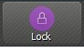

If the screens shall be unlocked, just press the button again or press the :guilabel:`Observe` button,
to switch back to monitoring mode globally.

In case only single computers shall be locked, you can select these as described in section :ref:`selecting computers`
and select the function in the context menu. The screen lock can be disabled either through the
:guilabel:`Unlock` entry or through the :guilabel:`Observe` entry. The screen lock can also be globally
activated at first and disabled individually for specific computers later on using the context menu.

.. note:: Due to the operating system's security concept, the lock screen cannot be displayed if there is no signed in user. Nevertheless, the input devices are locked thus making a login impossible.

.. index:: remote access, remote control, remote view

Remote access
-------------

The function group *remote access* consists of two rather similar functions: :guilabel:`Remote View` and :guilabel:`Remote Control`. Both access modes retrieve the screen data of a remote computer and display it in full screen mode in a separate window. In contrast to the monitoring mode in the main window, you can the observe events on a computer in detail and interact, if necessary.

These functions can be activated in various ways. Depending on the system configuration, one of the two starts by double-clicking a computer. Alternatively you can open the context menu by clicking the right mouse button and choose the desired function.

If you want to access a computer that is not shown in the workspace, you can use the button in the toolbar:

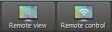

Upon confirmation a dialogue opens up that prompts you for the computer name:

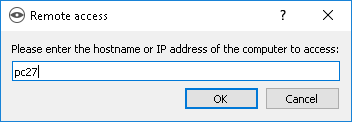

In all cases a new windows containing the remote view opens up:

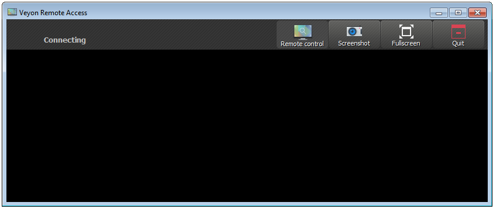

The remote screen is usually displayed within a few seconds and is updated in real time. As in the main application you have a toolbar with buttons on the window's upper border. This toolbar is automatically hid after a few seconds.  You can show it at any time by moving the cursor to the window's upper border.

Even during a running remote access session you can change the access mode at any time. For this it is sufficient to click the :guilabel:`Control from remote` resp. :guilabel:`Observe only` button. Please note, that these buttons do not indicate the current access mode, but the access mode that is switched to if the button is pressed.

As soon as you have entered the :guilabel:`Control from remote` mode, your keystrokes, mouse movements and mouse clicks are transmitted to the remote computer. Thus you can control it as you are used to.  Depending on the system configuration there may be exceptions concerning some special keys or keystroke combinations (shortcuts) such as e.g. :kbd:`Ctrl+Alt+Del`. If you want to use these shortcuts, you can use the additional :guilabel:`Send Shortcut` button. After clicking it, a menu opens up which allows for you to select the desired shortcut:

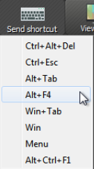

You can close the menu without triggering an action with a repeated click or the :kbd:`Esc` key.

If you want to switch to full screen mode, you can use the :guilabel:`Full Screen` button. In full screen mode you can use the same button -- now with the caption :guilabel:`Window` -- to switch back to window mode.

The function :guilabel:`Screenshot`  creates a screenshot an saves in to a file that can be viewed later on. A more detailed description can be found in sections :ref:`screenshot` and :ref:`screenshot management`.

You can use the :guilabel:`Exit` button to close the window and terminate the remote access.

Boot, restart and shutdown a computer
-------------------------------------

.. index:: boot, shutdown, restart, WoL, Wake-on-LAN

It can be helpful for administrative purposes as well as for preparation and post-processing of courses and IT-supported exams to use the functions :guilabel:`Boot`, :guilabel:`Restart` and :guilabel:`Shutdown` for a computer. You find the respective buttons in the toolbar:

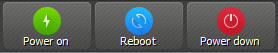

You can activate the respective button to boot, restart or shutdown all displayed computers. If you intend to use the function only for single computers, you can select them and choose the desired entry from the context menu.

.. attention:: Please note, that neither restart nor shutdown require the consent of the signed in user. Therefore make sure, that the signed in user has no unsaved work.

.. note:: Depending on the configuration of the network and the system settings of the single computer, booting may work only under specific technical conditions. At the same time there is no check for access control while booting such that you may be able to boot computers in other rooms or parts of the building. Please check the selected computers carefully if you use this function.

.. index:: log out, user log out, end of course

Log out user
------------

The function :guilabel:`Log out User` complements the options described in the previous section in terms of controlling basic computer states. That's what the respective button in the toolbar looks like:

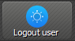

Activate this button to log out all users on all displayed computers. If you intend to use the function only for single computers, you can select them and choose the desired entry from the context menu.

.. hint:: A typical use case for this function could consist of terminating a course for all participants at a specified time.

.. attention:: Please note, that the logout process does not require the consent of the signed in uesr. Hence make sure that the signed in user does not have any unsaved work.

.. index:: text message, message, message window

Send text message
-----------------

A further possibility for interaction consists of sending text messages to one or all course participants. This message is displayed as a message window on the respective participant's computer. You can use the :guilabel:`Text Message` button to this end:

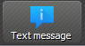

After pressing the button, a dialogue window opens up. Here you can enter the message to be transmitted:

.. image:: images/textmessage-dialog.png
   :align: center

You can send the typed message by pressing :guilabel:`OK`.

If you intend to use the function only for single computers, you can select them and choose the entry :guilabel:`Text Message` from the context menu.

.. index:: start program, program start, execute, commands, open document

Start program
-------------

If a specific application is to be opened on all computers, you can use the :guilabel:`Start Program` function from the toolbar. To do this click the button shown:

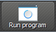

If programs have been predefined by the administrator, a menu with the predefined programs opens. In this menu you can click on the desired program.

If you want to start a program that is not included in the menu, click on the last entry `guilabel:`Custom program`. Then the same dialog appears, which also appears if no programs are predefined. In this dialog box you can enter the name of the desired program file, e.g. ``notepad``:

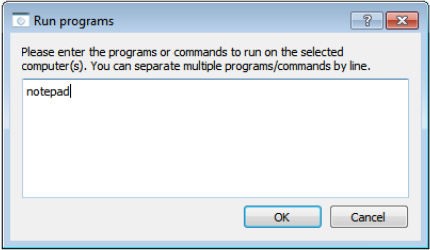

Subsequently confirm the dialogue with :guilabel:`OK`. Please note, that the requested program often does not reside in the program path environment such that you have to specify the complete path to the program, e.g. ``C:\Programme\VideoLAN\VLC\vlc.exe``.

.. hint:: Most programs offer the option of getting passed an additional parameter containing the name of a file that is to be opened automatically. For example, if you want to play a video simultaneously on all computers, just add the path of the video file separated by a blank, e.g. ``C:\Programme\VideoLAN\VLC\vlc.exe X:\Videos\Beispiel.mp4``.

.. attention:: In case the program path or file name contains blanks, the complete path and file name has to be enclosed in quotes. Otherwise parts of the input can be interpreted as parameters. Example: ``"C:\Program Files\LibreOffice 5\program\swriter.exe"``

.. index:: website, open website, browser, URL, web address

Open Website
------------

If all course participants shall navigate to a specific website, you can have this website automatically opened on all computers. Use the :guilabel:`Open Website` button for this:

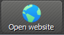

If no websites have been predefined by the administrator, a dialog box opens in which you can enter the address of the website to be opened:

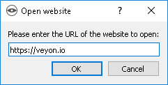

Confirm this dialogue with :guilabel:`OK`.

Otherwise, a menu with the predefined websites opens from which you can select and click on the desired website. If you want to open a website that is not included in the menu, select the last item `:guilabel:`Custom Website`. The dialog shown above then opens.

.. index:: screenshot
.. _Screenshot:

Screenshot
----------

With Veyon it is possible to save the current screen content of single or all computers in an image file. You can press the :guilabel:`Screenshot` button to make screenshots of all displayed computers:

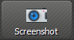

If you intend to use this function only for single computers, you can select them and choose the entry :guilabel:`Screenshot` from the context menu.

Afterwards a message informs you about the successful completion of this action. Now you can view the images through the :ref:`screenshot management` as well as delete them if necessary.
