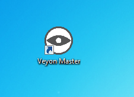
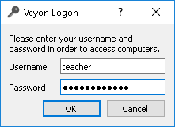
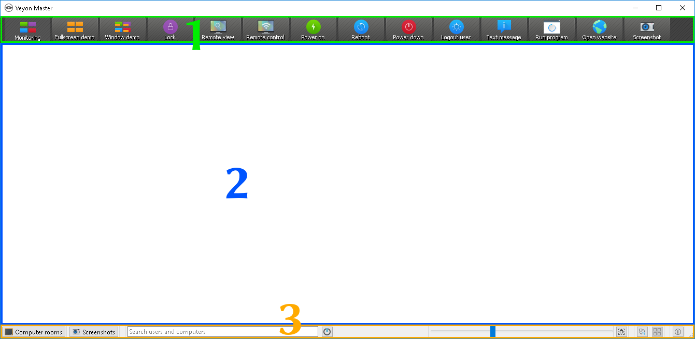
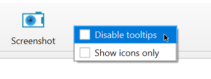
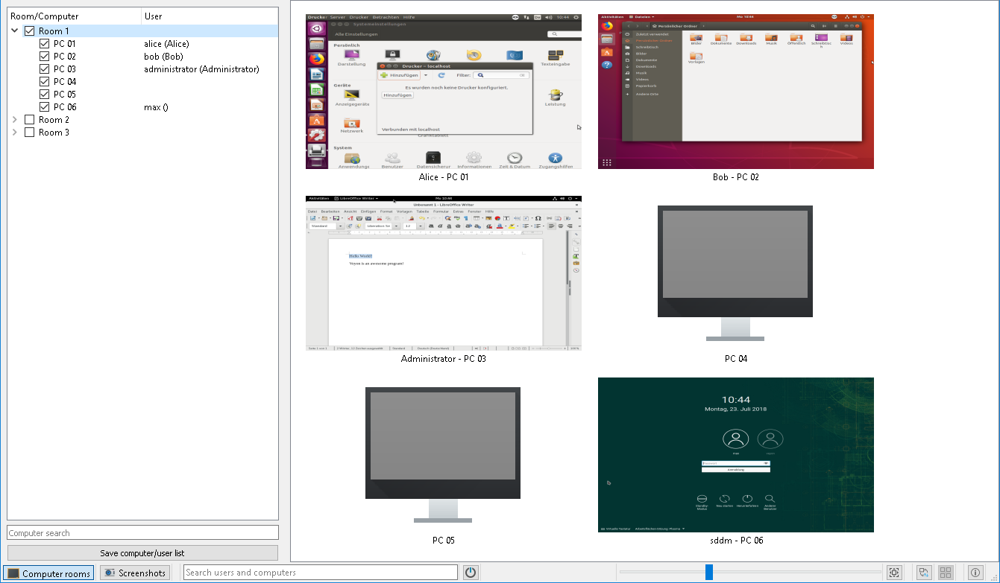
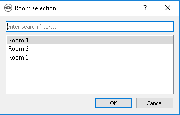
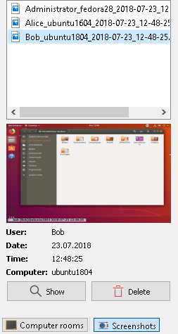

Introduction
============

Veyon is an application that lets you monitor and control a group of computers (e.g. classrooms) on a central computer (e.g. an instructor's computer) and use various features and modes.

Program start and login
------------------------

.. index:: Start menu, Desktop icon

The program is started via the start menu or a desktop icon:

.. index:: Login, Username, Password

Depending on the system configuration you will be prompted for your username and your password:

Enter your username and password here or – if given – the credentials of a special teacher account. If the entered data is correct and and a a login can be performed, the program will start. Otherwise, the login will be denied and an error message will be displayed. In this case you can try the login with corrected data again.

User interface
--------------

.. index:: User interface, Toolbar, Monitor view, Status bar

After the program start you will see the user interface with the toolbar (1), the monitor view (2) and the status bar with various controls (3):

The toolbar contains a number of buttons for activating different features. A detailed description of the individual features can be found in chapter :ref:`ProgramFeatures`. The appearance and behavior of the toolbar can be customized as described in section :ref:`Toolbar`.

In the monitor view all computers to be monitored are displayed in a tile view. Depending on the system configuration and previous program starts you can already see the computers at your current location here. The :ref:`computer select panel <ComputerSelectPanel>` allows you to show or hide computers or entire locations.

The elements in the status bar are used to control the program interface and are described in detail in the following section.

Status bar
----------

Using the :guilabel:`Locations & computers` and :guilabel:`Screenshots` buttons, you can open and close the :ref:`computer select panel <ComputerSelectPanel>` and the :ref:`screenshots panel <ScreenshotsPanel>`.

The search bar allows you to filter the computers displayed using computer names or user names as search terms. Technically savvy users can even enter regular expressions here to define advanced search filters.

The |powered-on| (:guilabel:`Only show powered on computers`) button hides all computers that are not powered on, disconnected or not reachable for some other reason. This allows simultaneous monitoring of a large number of computers or partially occupied rooms while focusing on the actually active computers.

Use the slider to control the size of the computer screens displayed. When holding then :kbd:`Ctrl` key, the size can also be changed using the mouse scroll wheel. The size is adjusted automatically by clicking the button |zoom-fit-best| (:guilabel:`Adjust optimal size`) to the right of it.

It is also possible to use a custom computer arrangement, e.g. to represent the actual arrangement of computers in classrooms. After clicking the button |exchange-positions-zorder| (:guilabel:`Use custom computer arrangement`) each computer individually or a selection of computers can be moved with the left mouse button pressed and arranged as desired. To align all computers in the custom arrangement, click the |align-grid| (:guilabel:`Align computers to grid`) button. If you want to use the sorted standard arrangement again, simply deactivate the |exchange-positions-zorder| button.

The |help-about| button (:guilabel:`About`) opens a dialog with information about Veyon such as version, manufacturer and license terms.

.. |align-grid| image:: images/align-grid.png
  :scale: 20%
  :align: middle

.. |exchange-positions-zorder| image:: images/exchange-positions-zorder.png
  :scale: 20%
  :align: middle

.. |powered-on| image:: images/powered-on.png
  :scale: 20%
  :align: middle

.. |help-about| image:: images/help-about.png
  :scale: 20%
  :align: middle

.. _Toolbar:

Toolbar
-------

You can customize the appearance and behavior of the toolbar. A right click on either a free section or a button opens a context menu with several entries:

If you click the entry :guilabel:`Disable balloon tooltips` no tooltips will be displayed anymore whenever you hover the mouse over the buttons. You can open the context menu at any time and uncheck the item again.

The :guilabel:`Show icons only` option gives a compact view of the toolbar buttons by hiding the labels and displaying only icons. On smaller screens this option may be necessary to display all buttons.

.. _ComputerSelectPanel:

Computer select panel
---------------------

.. index:: Computer select panel

The :guilabel:`Locations & Computers` button in the status bar opens the computer select panel. This panel displays all available computer locations in a tree structure. You can expand individual location entries by clicking on the corresponding symbol in front of them.

You can activate individual computers or entire locations by checking them. All checked computers will then be displayed in the monitoring view.

With the :guilabel:`Save computer/user list` button you can save the list of computers and logged in users in a CSV file. Typical use cases for this are subsequent presence checks or IT-based exams.

Depending on the system configuration, the button :guilabel:`Add location` is also available. This allows you to add more computer locations to the view. A click on the button opens a dialog where you can see all available locations:

You can filter the list using the input field, i.e. enter a search term. The list then only displays the location names containing the specified search term. Advanced users can also use regular expressions for the filter. Next you can select the location and confirm with :guilabel:`OK`. The selected location is now available in the location list until the next program start. You can also remove a previously added location by clicking on the location and pressing the :kbd:`Del` key.

.. _ScreenshotsPanel:

Screenshots panel
-----------------

.. index:: Screenshots panel

Using the screenshot management panel, you can view and delete all captured screenshots. Information on how to take screenshots are given in the :ref:`Program features <ProgramFeatures>` chapter in section :ref:`Screenshot <FeatureScreenshot>`.

You can now select individual screenshots from the list. Details of the screenshot, such as the date it was taken, user name, and computer, are then displayed in the table below. The :guilabel:`Show` button or a double-click in the list displays the selected screenshot in full size. If you no longer need the screenshot, you can permanently delete it using the :guilabel:`Delete` button. Please note that this process cannot be undone and the files will not be moved to the trash.
