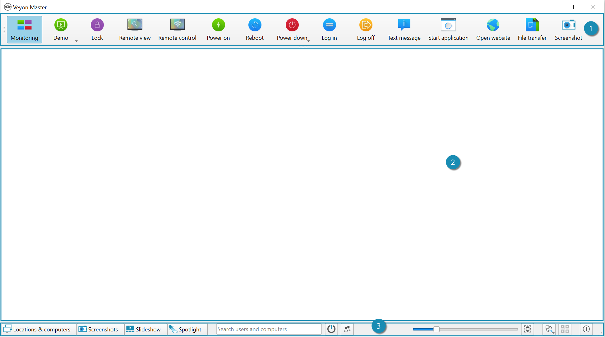

Introduction
============

Veyon is an application that allows you to map, keep track of, control, and perform various functions on a centralized computer (such as a teacher's PC), a cluster of computers (such as classrooms or labs) and modes to use.

Program start and registration
------------------------------

The program is started via the :index:`start menu` or an :index:`desktop icon`:

.. image:: images/desktop-symbol.png
   :align: center

Depending on the system configuration you will be prompted for :index:`username` and :index:`password`:

.. image:: images/logon-dialog.png
   :align: center

Enter here your username and password or, if given, the access data of a special teacher account. If the entered data is correct and you can log in, the program starts. Otherwise, the :index:`Login` is denied and an error message is displayed. You can try reentering in this case.

User Interface
----------------

After starting the program you will see a :index:`user interface` with a :index:`toolbar` (1), a :index:`workspace` (2) and a :index:`status bar` with various controls (3):

The toolbar contains a number of buttons for activating different functions. A detailed description of the individual functions can be found in the chapter :ref:`Program features`. The appearance and behavior of the toolbar can be adjusted as described in the section :ref:`Toolbar`.

In the workspace, all computers to be monitored are displayed in a :index:`tile view`. Depending on the system configuration and previous program launches, you will already see the computers of the current room here. You can use the `Computer rooms`_ to show or hide computers or entire computer rooms.

The elements in the status bar are used to control the program interface and are described in more detail in the following section.

Status bar
----------

Using the :guilabel:`Computer rooms` and :guilabel:`Screenshots` buttons, you can open and close views such as :ref:`Computer rooms` or :ref:`Screenshots`.

The search bar allows you to filter the computers displayed using search terms such as computer names or user names. Technically savvy users can even enter regular expressions here to implement advanced search filters.

The |powered-on| (:guilabel:`Only show powered on computers`) button hides all computers that are not turned on or accessible. This allows simultaneous observation of a large number of computers or only partially occupied rooms while simultaneously focusing on the actually active computers.

Use the slider to control the size of the computer screens displayed. With the :kbd:`Ctrl` key pressed, the size can also be changed using the mouse scroll wheel. An automatic adjustment to the optimal size is done by pressing the button |zoom-fit-best| (:guilabel:`Adjust optimal size`) to the right of it.

Since Veyon 4.1 it is possible to use a user-defined computer arrangement, e.g. to map the actual arrangement of computers in the classroom. After activating the |exchange-positions-zorder| button (:guilabel:`Use custom computer placement`), each computer can be moved individually or in a selected group with the mouse button pressed and arranged as desired. To align all computers after arranging them, you can use the |align-grid| button (:guilabel:`Align computers to grid`). If the sorted default arrangement is to be used again, simply deactivate the |exchange-positions-zorder| button.

The |help-about| button (:guilabel:`About`) opens a dialog with information about Veyon such as version, manufacturer and license terms.

.. |zoom-fit-best| image:: images/zoom-fit-best.png
  :scale: 20%
  :align: middle

.. |align-grid| image:: images/align-grid.png
  :scale: 20%
  :align: middle

.. |exchange-positions-zorder| image:: images/exchange-positions-zorder.png
  :scale: 20%
  :align: middle

.. |powered-on| image:: images/powered-on.png
  :scale: 20%
  :align: middle

.. |help-about| image:: images/help-about.png
  :scale: 20%
  :align: middle

.. _Toolbar:

Toolbar
--------------

You can customize the look and feel of the toolbar to your liking. With a right-click on a free area as well as a button, a context menu opens for several entries:

.. image:: images/toolbar-contextmenu.png
   :align: center

If you click the entry :guilabel:`Disable Balloon Tooltips` you will no longer see any tooltips when you move the mouse over the buttons. You can open the context menu again at any time and remove the hook with a click.

The option :guilabel:`Show Icons Only` causes a compact representation of the buttons in the toolbar by hiding the labels and displaying only icons. On smaller screens, this option may be necessary to display all the buttons.

.. _`Computer room`:

Computer rooms
--------------

.. index:: `Computer rooms`

You can use the button :guilabel:`Computer Rooms` in the :index:`Status Bar` to open the computer rooms view. This view displays all available computer rooms in a tree structure. Individual room entries can be expanded using a usually triangular symbol.

You can activate individual computers or entire rooms by clicking on them. All activated computers are displayed in the workspace.

.. image:: images/computer-room-management.png
   :align: center

With the button :guilabel:`Save computer/user List` you can save the list of computers and logged in users in a CSV file. A typical use case for this is a presence check at a later time.

Depending on the system configuration, the button :guilabel:`Add room` is also available. You can add more computer rooms to view. A click on the button opens a dialog in which you can see all available rooms:

.. image:: images/room-selection.png
   :align: center

You can filter the list using the input field, that is, enter a search term. In the list then only the room names are displayed, in which the entered search term occurs. Advanced users can also use regular expressions for the filter. Then you can select a room and confirm with :guilabel:`OK`. The selected room is now available in the room list until the next program restart. You can also remove an added room by clicking on a room and pressing the :kbd:`Del` key.

.. _`Screenshots`:

Screenshots
-----------

.. index:: `Screenshots`

The management view for screenshots allows you to view and delete captured screenshots. See the :ref:`Program Functions` chapter in section :ref:`Screenshot` for an explanation on how to take screenshots.

.. image:: images/screenshot-management.png
   :align: center

You can now select individual screenshots in the list. It will then display details about the screen shot, such as shooting date, user name, and computer in the table below. The button :guilabel:`Show` or a double-click in the list displays the selected screenshot in full size. If you no longer need the screenshot, you can permanently delete it using the :guilabel:`Delete` button. Please note that this process can not be undone and the files are not moved to the trash.
